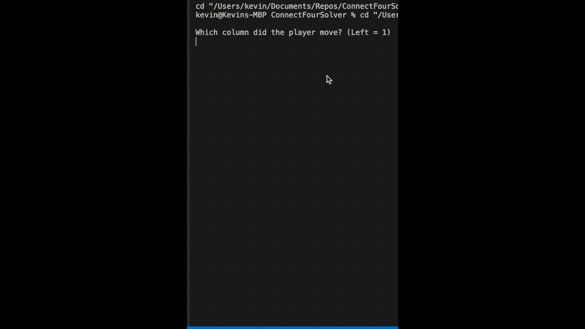

# ConnectFourSolver

## DEMO

### Description
This project is based on an interest that I explored with Game Theory for the Connect Four Game. The minimax algorithm is a game solving decision rule that I explored in Java. I also implemented the alpha-beta pruning optimizations as well as game specific optimizations including intelligent bitwise operations.
